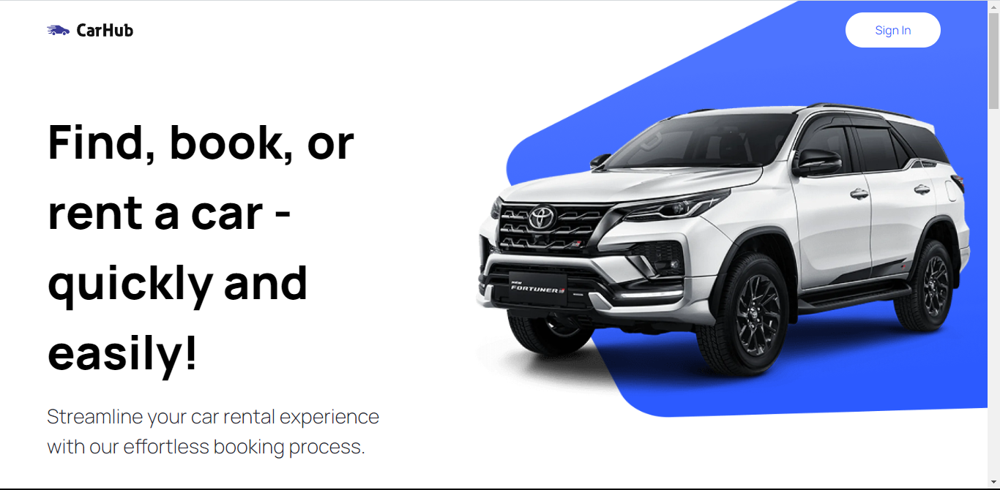
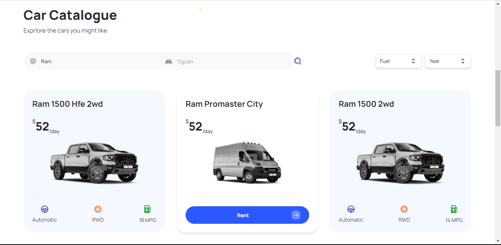
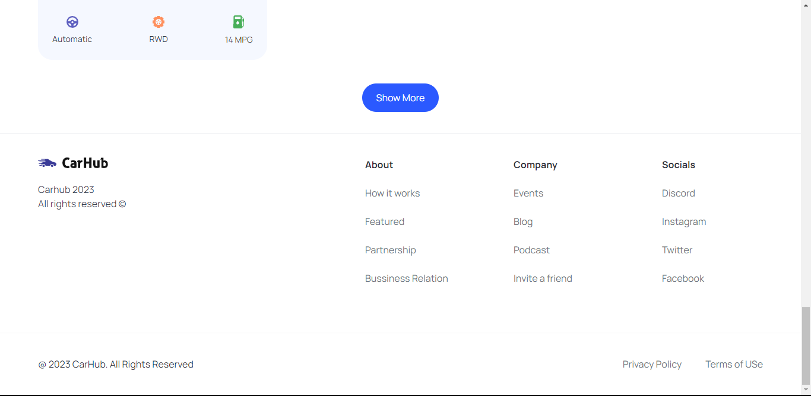
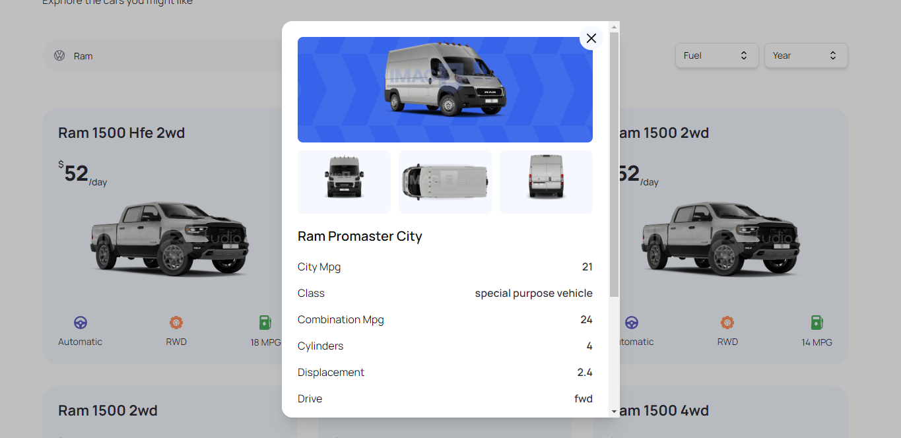

# Car Showcase and Rental - Next JS App

This Project is a single paged next JS app, that purposes to showcase a large variety of car models and brands, their rental price, make specifics, year of production and mirage. Data of this cars was obtained from [rapid APIs website](https://www.youtube.com/redirect?event=video_description&redir_token=QUFFLUhqbThza09qMnFkb3hod3Vyb1hJRlJCaF9xWFMyUXxBQ3Jtc0tsNnFPZnYxaWl2eXM3bTY2WDZuOVgwaXZGbkZ6czYyNWdkWWpHMFhIX3lCenIxTXNyWDNuTkpxcXkzUXJRWmZ3NUFNS3JmZURCcTJ1ZDdsajY3NHg2dUd1QjQycTI3b0lBQnkwSkREbW1CMktYRVg3cw&q=https%3A%2F%2Frapidapi.com%2Fapininjas%2Fapi%2Fcars-by-api-ninjas%3Futm_source%3Dyoutube.com%2FJavaScriptMastery%26utm_medium%3Dreferral%26utm_campaign%3DDevRel&v=pUNSHPyVryU). Have fun going through this document to get familiar with this cool project.

## Table of contents

- [Overview](#overview)
  - [Getting Started](#getting-started)
  - [Screenshot](#screenshot)
  - [Links](#links)
- [My process](#my-process)
  - [Built with](#built-with)
  - [What I learned](#what-i-learned)
  - [Continued development](#continued-development)
  - [Useful resources](#useful-resources)
- [Author](#author)
- [Acknowledgments](#acknowledgments)

## Overview

### Getting Started

First, run the development server:

```bash
npm run dev
# or
yarn dev
# or
pnpm dev
# or
bun dev
```

To see specific project dependancies, take a look at the [package.json](./package.json) file in the root folder.

Open [http://localhost:3000](http://localhost:3000) with your browser to see the result.

This project uses [`next/font`](https://nextjs.org/docs/basic-features/font-optimization) to automatically optimize and load Inter, a custom Google Font.

### Screenshots






### Links

- Solution URL: [github repo](https://github.com/Jaweki/car_showcase)
- Live Site URL: [deployment on vercel](https://car-showcase-wheat-three.vercel.app/?fuel=gas&year=2016&manufacturer=ram)

## My process

### Built with

- [headless ui](https://headlessui.com/) - CSS framework
- [Tailwindcss](https://tailwindcss.com/) - CSS framework
- [React](https://reactjs.org/) - JS library
- [Next.js](https://nextjs.org/) - React framework

### What I learned

Well, this was a great leaners project, but here's some of the most important aspects of the project:

- Pop ups in the UI. When a user hovers and clicks on the rent button, a popup panel shows, and is populated with the specifics of the car, and the othographic pictures of the cars sides. This was made possible by the styles provided by headless ui; specifically, Transition and Dialog components. see the code below:

```js
<Transition appear show={isOpen} as={Fragment}>
  <Dialog as="div" className="relative z-10" onClose={closeModal}>
    <Transition.Child
      as={Fragment}
      enter="ease-out duration-300"
      enterFrom="opacity-0"
      enterTo="opacity-100"
      leave="ease-in duration-200"
      leaveFrom="opacity-100"
      leaveTo="opacity-0"
    >
      <div className="fixed inset-0 bg-black bg-opacity-25" />
    </Transition.Child>

    <div className="fixed inset-0 overflow-y-auto">
      <div>
        <Transition.Child
          as={Fragment}
          enter="ease-out duration-300"
          enterFrom="opacity-0 scale-95"
          enterTo="opacity-100 scale-100"
          leave="ease-in duration-200"
          leaveFrom="opacity-100 scale-100"
          leaveTo="opacity-0 scale-95"
        >
          <Dialog.Panel>
            <button type="button" onClick={closeModal}>
              <Image src="/close.svg" alt="close" width={20} height={20} />
            </button>

            <div>
              <div>
                <Image
                  src={generateCarImageUrl(car)}
                  alt="car model"
                  fill
                  priority
                />
              </div>

              <div>
                <div>
                  <Image
                    src={generateCarImageUrl(car, "29")}
                    alt="car model"
                    fill
                    priority
                  />
                </div>
                <div>
                  <Image
                    src={generateCarImageUrl(car, "33")}
                    alt="car model"
                    fill
                    priority
                  />
                </div>
                <div>
                  <Image
                    src={generateCarImageUrl(car, "13")}
                    alt="car model"
                    fill
                    priority
                  />
                </div>
              </div>
            </div>

            <div>
              <h2>
                {car.make} {car.model}
              </h2>

              <div>
                {Object.entries(car).map(([key, value]) => (
                  <div key={key}>
                    <h4>{key.split("_").join(" ")}</h4>
                    <p>{value}</p>
                  </div>
                ))}
              </div>
            </div>
          </Dialog.Panel>
        </Transition.Child>
      </div>
    </div>
  </Dialog>
</Transition>
```

The Transition component from headless ui, guides the smooth appearance and fade away of the car details popup component.
The Dialog.Child component allows popupalting dynamic data in the popup card.

- Another main aspect this project employs is the interactive search bar. The search bar is a Combobox and Transition components provided by headless ui, which when configured appropriately, allows the results to be rendered per key stroke.

```js
<Combobox value={manufacturer} onChange={setManufacturer}>
  <div className="relative w-full">
    <Combobox.Button className={"absolute top-[14px]"}>
      <Image
        src={"/car-logo.svg"}
        width={20}
        height={20}
        className="ml-4"
        alt="car-logo"
      />
    </Combobox.Button>

    <Combobox.Input
      className={"search-manufacturer__input"}
      placeholder="Volkswagen"
      displayValue={(manufacturer: string) => manufacturer}
      onChange={(e) => {
        setQuery(e.target.value);
      }}
    />

    <Transition
      as={Fragment}
      leave="transition ease-in duration-100"
      leaveFrom="opacity-100"
      leaveTo="opacity-0"
      afterLeave={() => setQuery("")}
    >
      <Combobox.Options>
        {filteredManufacturers.map((item) => (
          <Combobox.Option
            key={item}
            className={({ active }) => `
                   relative search-manufacturer__option
                   ${active ? "bg-primary-blue text-white" : "text-gray-900"}
                   `}
            value={item}
          >
            {({ selected, active }) => (
              <>
                <span
                  className={`block truncate ${
                    selected ? "font-medium" : "font-normal"
                  }`}
                >
                  {item}
                </span>
              </>
            )}
          </Combobox.Option>
        ))}
      </Combobox.Options>
    </Transition>
  </div>
</Combobox>
```

Combobox component has a variety of child components; used in this project were the Combobox.Button, Combobox.Input, Combobox.Options and Combobox.Option. The most important is the state awareness of the Combobox.Option component for when an item has been selected or active, realy important when rendering dynamic styles on an item list.

- Finally most Important for a user centric web application, is the sharing of a users page via urls. This app implements server side rendering, thus props are passed down components as url search params. As an example, take a look at the page.tsx in the app route:

```js
export default async function Home({
  searchParams,
}: {
  searchParams: FilterProps,
}) {
  const allCars = await fetchCars({
    manufacturer: searchParams.manufacturer || "",
    year: searchParams.year || 2022,
    fuel: searchParams.fuel || "",
    limit: searchParams.limit || 10,
    model: searchParams.model || "",
  });
  /* Rest of the code*/
}
```

### Continued development

At this point this project is on stale developement. No more planned development is on schedule, but If any developer or user might have a request to futher advance it, I would be glad to get involved. Its a fun project 🎉.

### Useful resources

- [Javascipt Mastery Youtube channel](https://www.youtube.com/watch?v=pUNSHPyVryU&t=1s) - Adrian the director at [Javascript Mastery]() is a great mentor at web development and UI/UX design implementation.

- [headless ui](https://headlessui.com/) - CSS framework, [Tailwindcss](https://tailwindcss.com/) - CSS framework, [React](https://reactjs.org/) - JS library, [Next.js](https://nextjs.org/) - React framework. the docs at this official websites do actually give detailed guide on how to develop and implement User centric UI designs.

- [rapid Api](https://rapidapi.com) - this site was supper important as this is where all the data relevat to the cars displayed in the website, was found. Check out the site to get familiar with data of almost any kind of material, devices or objects in the mordern market.

## Author

- Website - [Jack Weru | Jaweki](https://portfolio.jaweki.com)

## Acknowledgements

Thanks so much to Adrian at [Javascript Mastery](https://jsmastery.pro), I got a chance to ramp up my web developer skills with react. Adrian has a cool way to write code while teaching (as in he literally explains what every line of code does; way to go Adrian).
Am proud to also have made meaningful use of my time to learn this react in next.js via this tutotial.
Am greatful for the AI technologies Chat GPT AI by open ai and Bard AI by google. The AI explains in detail difficult to undertand concepts, generates code samples to emphasise on discussions and more. Thanks to Open AI.

## Learn More

To learn more about Next.js, take a look at the following resources:

- [Next.js Documentation](https://nextjs.org/docs) - learn about Next.js features and API.
- [Learn Next.js](https://nextjs.org/learn) - an interactive Next.js tutorial.

You can check out [the Next.js GitHub repository](https://github.com/vercel/next.js/) - your feedback and contributions are welcome!

## Deploy on Vercel

The easiest way to deploy your Next.js app is to use the [Vercel Platform](https://vercel.com/new?utm_medium=default-template&filter=next.js&utm_source=create-next-app&utm_campaign=create-next-app-readme) from the creators of Next.js.

Check out the [Next.js deployment documentation](https://nextjs.org/docs/deployment) for more details.
